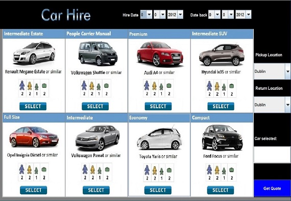

**#Car Hire Application**

Language: Java

Description: A Java Project to create an interactive user application. I created an application for a Car Hire Company which allows users to get a quick quote and choose a car for hire from a list of pictures on screen. The user enters when they want the car and when they tend to leave it back. If the car is unavailable the user will be asked to choose another car from the list. When the users are happy with their selection they go on to the next page showing the car details and then they enter their payment details. They summit these details, and a message comes up saying the car is booked.
